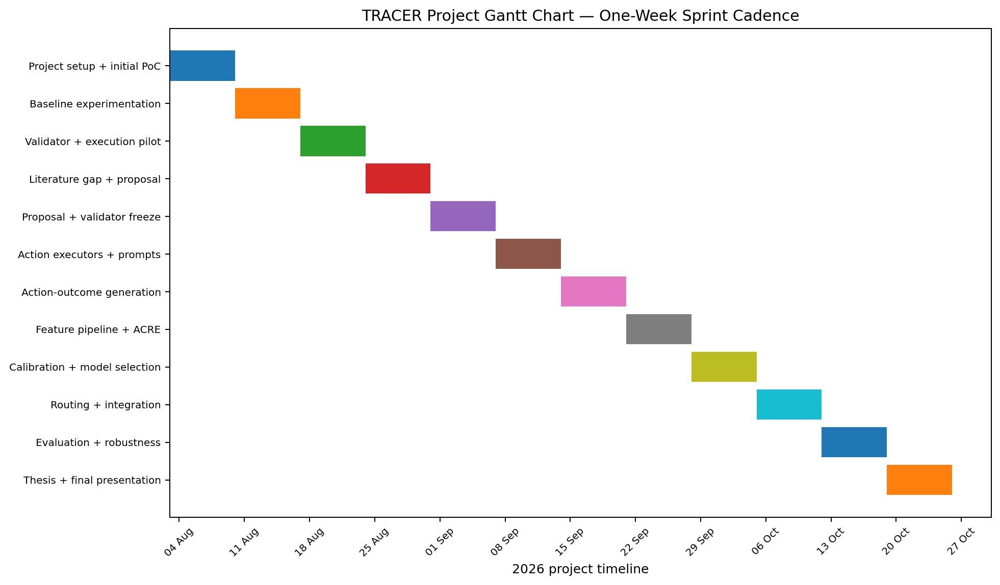

# 5. Project Management Plan

**Related Jira:** TRACER-125  
**Status:** Proposal-ready plan aligned to the current Jira milestones and one-week sprint cadence.

## 5.1 Agile and Scrum Delivery Approach

TRACER is managed using an **Agile, Scrum-style research delivery process with one-week sprints**. Agile is suitable for this project because the work contains research uncertainty: benchmark limitations, validator behaviour, model/API availability, feature usefulness, and experimental findings can require the team to revise implementation details while keeping the research question and evaluation controls stable. A short sprint cadence allows the team to test assumptions early and reduce the risk of discovering critical problems only near the final evaluation.

Scrum is adapted to the academic research setting as follows:

- **Product/Research Backlog:** Jira contains the ordered epics, stories, tasks, dependencies, acceptance criteria, and review gates.
- **Sprint Planning:** at the beginning of each one-week sprint, the team selects the highest-priority research and implementation items that are ready to execute.
- **Weekly coordination / stand-up check:** progress, blockers, experiment dependencies, and review needs are discussed during the sprint rather than waiting for the end of a larger phase.
- **Sprint Review:** completed code, literature artefacts, validators, datasets, or experiment outputs are demonstrated or reviewed against their acceptance criteria.
- **Retrospective:** the team records process or experimental issues and adjusts the next sprint where necessary.
- **Increment:** each sprint should produce a versioned research increment such as a validated dataset slice, frozen protocol, experiment runner, model artefact, evaluation result, or proposal/thesis section.

GitHub is used for source control, pull requests, experiment artefacts, and research documentation. Jira is the source of truth for work status and dependencies. Research-critical changes are versioned and reviewed so that the project remains iterative without silently changing the experimental design after seeing results.

## 5.2 Work Breakdown Structure and Responsibility Allocation

The supervisor requested the WBS to identify the member responsible for each work package. The allocation below is a **primary responsibility model**: it assigns a lead for coordination while retaining peer review by the other members. Jira may be updated if workload is rebalanced.

| WBS | Work package | Jira | Primary responsible member(s) | Supporting/review members | Exit condition |
|---|---|---|---|---|---|
| 1.0 | Literature study and research definition | TRACER-8 | **Lithma Perera** | Sayuru, Sulakna | Evidence matrix, closest-work gap, research definitions, verified reference set |
| 2.0 | Research proposal | TRACER-119 | **Sayuru Rehan Bopitiya** | Lithma, Sulakna | Proposal content integrated, citations checked, submission review complete |
| 3.0 | Data preparation and validators | TRACER-19 | **Sulakna Weerasinghe** (data/provenance) + **Sayuru** (validator implementation) | Lithma | Versioned manifests, provenance, objective validators, review protocol |
| 4.0 | Action-outcome generation | TRACER-20 | **Sayuru Rehan Bopitiya** | Lithma, Sulakna | Frozen action contracts and labelled ACCEPT/REPAIR/REGENERATE outcomes |
| 5.0 | ACRE model and calibration | TRACER-21 | **Sayuru Rehan Bopitiya** | Lithma, Sulakna | Leakage-safe feature pipeline, trained risk model, calibrated heads |
| 6.0 | Routing policy and end-to-end integration | TRACER-75 | **Sayuru Rehan Bopitiya** | Lithma, Sulakna | `epsilon` policy integrated with all actions and repeatable runner |
| 7.0 | Evaluation, robustness and statistics | TRACER-22 | **Sayuru Rehan Bopitiya** (analysis) + **Sulakna Weerasinghe** (QA) | Lithma | Held-out results, baselines, ablations, calibration/robustness analysis |
| 8.0 | Governance and living documentation | TRACER-10 | **Sayuru Rehan Bopitiya** | Lithma, Sulakna | Decision log, experiment registry, risk register, documentation current |
| 9.0 | Thesis and final presentation | TRACER-23 | **All three members**; Sayuru coordinates integration | All three | Final thesis narrative, figures/tables, presentation, reproducibility package |

### Milestone dates

| Work package | Target milestone |
|---|---:|
| Literature study and research definition | **3 Sep 2026** |
| Research proposal | **3 Sep 2026** |
| Data and validators | **6 Sep 2026** |
| Action-outcome generation | **20 Sep 2026** |
| ACRE model and calibration | **4 Oct 2026** |
| Routing and end-to-end integration | **11 Oct 2026** |
| Evaluation and robustness | **18 Oct 2026** |
| Governance and living documentation | **25 Oct 2026** |
| Thesis and final presentation | **25 Oct 2026** |

## 5.3 One-Week Sprint Plan

| Sprint | Dates | Primary focus | Target output |
|---|---|---|---|
| 1 | 3–9 Aug | Project/repository setup, initial literature and PoC framing | Backlog, repository structure, early experiments |
| 2 | 10–16 Aug | Baseline model experimentation | Shared Qwen/Gemma experiment pipeline and initial evidence |
| 3 | 17–23 Aug | Validator hardening and correctness pilot | Docker validator improvements, execution pilot, correctness hierarchy |
| 4 | 24–30 Aug | Literature gap + proposal drafting | Evidence matrix, closest-work comparison, proposal Sections 1–3 |
| 5 | 31 Aug–6 Sep | Proposal integration + data/validator freeze | Proposal submission candidate; dataset/validator v1 |
| 6 | 7–13 Sep | Action executors and prompt contracts | ACCEPT/REPAIR/REGENERATE implementation + pilot |
| 7 | 14–20 Sep | Full action-outcome generation | Versioned three-action dataset v1 |
| 8 | 21–27 Sep | Feature pipeline and ACRE training | Leakage-safe feature dataset + candidate models |
| 9 | 28 Sep–4 Oct | Calibration and model selection | Final ACRE model + calibrated action-risk heads |
| 10 | 5–11 Oct | Routing policy and integration | End-to-end TRACER runner + baseline policies |
| 11 | 12–18 Oct | Held-out evaluation and robustness | Primary results, calibration, ablations, transfer analysis |
| 12 | 19–25 Oct | Thesis/final presentation and governance close-out | Final technical narrative, reproducibility package, presentation |

## 5.4 Gantt Chart

**Figure 1.** TRACER project Gantt chart aligned to the current one-week sprint plan and Jira milestone sequence.

The same dates are also provided in tabular form so the schedule remains readable if the figure is reformatted in the official proposal template.

## 5.5 Team Responsibilities

The table below is a **working delivery allocation**, not a contribution-percentage statement. The team may rebalance workload in Jira as implementation progresses.

| Team member | Planned primary responsibilities | Shared/review responsibilities |
|---|---|---|
| **Sayuru Rehan Bopitiya** | Technical/project coordination; experiment infrastructure; ACRE modelling/calibration; routing integration; evaluation/statistical analysis; repository/Jira coordination | Literature/methodology review; proposal/thesis integration; PR review |
| **Lithma Perera** | Literature/research-definition coordination; methodology/data-design review; validator/data-quality review; documentation quality | Experiment review; proposal/thesis writing; PR review |
| **Sulakna Weerasinghe** | Dataset provenance/QA support; benchmark/test verification; experiment/result checking; research documentation support | Literature review; evaluation QA; proposal/thesis review |

### Team-level responsibilities

All three members share responsibility for:

- approving the final research definition and gap statement;
- reviewing dataset/validator choices;
- reviewing high-impact experiment changes;
- checking proposal/thesis claims against evidence;
- reviewing pull requests for research-critical changes;
- ensuring results are reproducible and honestly reported.

## 5.6 Quality and Change Control

### Definition of Ready

A research/backlog item is ready when:

- the research or implementation objective is clear;
- inputs/dependencies are available;
- expected artefact/output is identified;
- acceptance criteria are testable;
- known risks or data dependencies are recorded.

### Definition of Done

A research/backlog item is done when:

- required code/data/documentation is versioned;
- acceptance criteria are demonstrably met;
- tests/checks pass where applicable;
- experiment configuration and evidence are recorded;
- required peer/team review is complete;
- Jira links to the relevant evidence or repository artefact.

### Change control

Changes to the frozen research question, action definitions, model roles, dataset split, action prompts, validator rules, feature schema, calibration policy, or held-out evaluation procedure must be recorded before the corresponding full experiment is rerun. This prevents post-hoc modification of the experiment solely because of observed results.

## 5.7 Risk Management Summary

| Risk | Likelihood | Impact | Owner | Mitigation |
|---|---|---|---|---|
| Dataset/validator labels are noisy or incomplete | Medium | High | Lithma + Sulakna | Prefer objective tests; independently verify fixtures; separate unresolved cases |
| Generated code is unsafe to execute | Medium | High | Sayuru | Docker isolation, network disabled, resource caps, read-only execution |
| Strong-model API/version changes | Medium | High | Sayuru | Record exact model/date/config; freeze full-run window; version outputs |
| ACRE overfits or is poorly calibrated | Medium | High | Sayuru | Grouped splits, simple baselines, calibration set, ablations, bootstrap analysis |
| Gold/reference leakage enters ACRE features | Low–Medium | Critical | Entire team | Explicit forbidden-feature schema and review gate |
| REPAIR/REGENERATE prompts create unfair comparison | Medium | High | Entire team | Freeze prompts and same strong-model version/settings |
| Sample size is insufficient for subgroup claims | Medium | Medium–High | Entire team | Predefine primary metric; aggregate only defensible subgroups; report CIs |
| Schedule slips because action generation/API calls are slow | Medium | High | Sayuru | Pilot throughput early; checkpoint outputs; prioritise mandatory datasets |
| Team review/dependency bottlenecks | Medium | Medium | Entire team | Weekly sprint planning, explicit reviewers, small PRs, Jira review gates |
| Literature novelty claim becomes outdated | Low–Medium | Medium | Lithma | Evidence-bounded wording; final literature check before submission/thesis |

A more detailed risk register is provided in `Appendix_B_Detailed_Risk_Register.md`.

## 5.8 Communication and Reporting

- **Weekly sprint planning/review:** confirm completed work, blockers, and next sprint goal.
- **Jira:** source of truth for backlog status, dependencies, due dates, and acceptance criteria.
- **GitHub:** source of truth for versioned implementation, experiment artefacts, literature notes, and proposal drafts.
- **Pull requests:** preferred review mechanism for research-critical repository changes.
- **Decision log/experiment registry:** used for changes that affect experimental interpretation.

This structure gives the project a traceable path from research question to implementation, evaluation, and final reporting.
