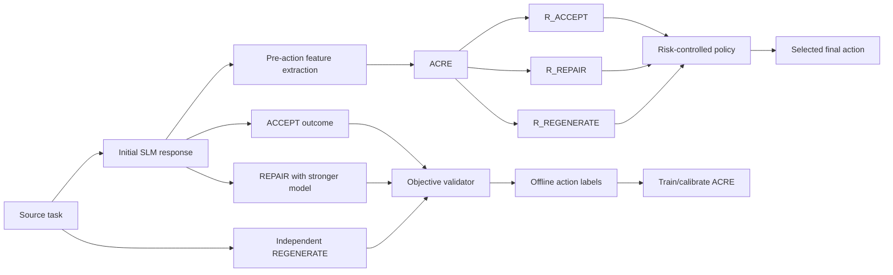

# Appendix A. Detailed Technical Specification

**Purpose:** Supporting technical detail for the proposal without overloading Section 4.

## A.1 End-to-End Research Pipeline



The lower branch (`F1/F2/F3 -> validator -> labels`) is the **offline supervision/evaluation path**. The ACRE inference path does not consume gold answers or future action outcomes.

## A.2 Action Contract

| Action | Stronger model called? | Receives initial SLM response? | Intended behaviour |
|---|---:|---:|---|
| ACCEPT | No | N/A | Return current SLM response unchanged |
| REPAIR | Yes | Yes | Correct/edit the existing SLM response |
| REGENERATE | Yes | No | Solve the task independently |

## A.3 Primary Feature Families

| Feature family | Examples | Inference-safe? |
|---|---|---:|
| Task representation | embedding, task/domain indicator, input length | Yes |
| Initial-response representation | embedding, response length/structure | Yes |
| SLM uncertainty | token log-probability statistics, entropy where available | Yes |
| Pre-action diagnostics | syntax/static checks that do not use hidden gold tests | Yes |
| Gold/reference | expected answer, reference code, benchmark reasoning trace | **No** |
| Future outcomes | REPAIR output correctness, REGENERATE output correctness | **No** |

## A.4 ACRE Model

```text
Z(x, y)
  |
Dense 256 + ReLU
  |
Dropout 0.2
  |
Dense 128 + ReLU
  |----------------------|-------------------------|
Sigmoid                 Sigmoid                   Sigmoid
R_ACCEPT                R_REPAIR                  R_REGENERATE
```

Training uses the three observed binary outcome labels. Post-hoc calibration is applied separately to the three heads on validation/calibration data.

## A.5 Routing Pseudocode

```text
risks = calibrated_acre(features)

if risks.ACCEPT <= epsilon:
    action = ACCEPT
else:
    action = argmin(risks.REPAIR, risks.REGENERATE)
    if min(risks.REPAIR, risks.REGENERATE) > epsilon:
        mark unresolved_for_analysis = true

execute(action)
```

The unresolved flag is an analysis state and not a fourth learned action.

## A.6 Correctness Evidence Hierarchy

1. Authoritative executable/deterministic tests.
2. Syntax/compile failure.
3. Normalised exact/AST reference match as positive evidence.
4. Documented adjudication for unresolved cases.
5. Similarity/confidence diagnostics only.

Infrastructure failures are kept separate from candidate failures.

## A.7 Minimum Experiment Outputs

For each held-out source example, preserve:

- source task ID/domain;
- initial SLM ID/version and response;
- pre-action feature version;
- predicted raw action risks;
- calibrated action risks;
- selected policy/action;
- actual ACCEPT/REPAIR/REGENERATE labels (offline evaluation only);
- final routed correctness;
- validator evidence;
- model/API configuration;
- latency/tokens/strong-model call flag.
