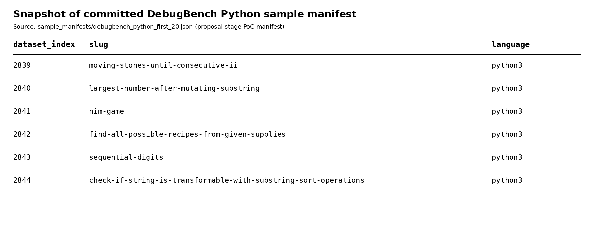

# Appendix C. Current Dataset Snapshot

This appendix provides proposal-stage evidence of the committed DebugBench data manifest already used during the TRACER proof of concept. The full research dataset will be versioned and split before downstream action generation as described in the methodology.

**Figure C1.** Sample rows from the committed `Rtian/DebugBench` Python test manifest. The PoC manifest records the dataset index, problem slug, language, selection rule, and dataset checksum so the sampled tasks can be reproduced.

The screenshot is evidence of the current project stage rather than the complete final multi-domain dataset. FinQA and EvalPlus-style manifests will be added during the data/validator work package and versioned before full action-outcome generation.
