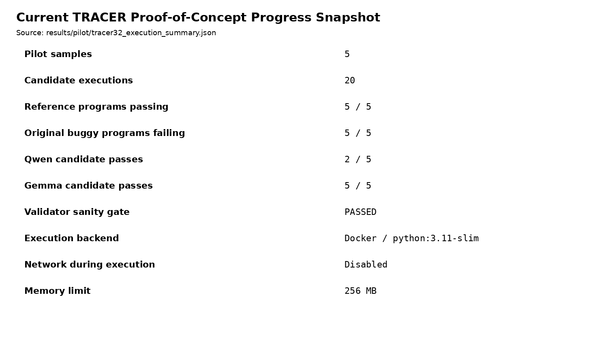

# Appendix D. Current Development and PoC Progress

TRACER is still in the research and development phase, but the repository contains a working proof-of-concept validation pipeline. The pilot was used to test the Docker execution approach and freeze the correctness-evidence hierarchy before scaling the experiment.

**Figure D1.** Current execution-pilot summary. The five reference programs all passed, the five original buggy programs all failed, and the validator sanity gate passed. Across the same pilot, Qwen passed 2/5 candidate executions and Gemma passed 5/5. These are pilot results only and are not presented as final comparative model performance.

The current progress demonstrates that the project has already produced: a versioned DebugBench sample manifest, local SLM baseline experimentation, an isolated Docker validation path, deterministic pilot fixtures, a correctness-evidence hierarchy, and repository/Jira experiment governance. The full ACCEPT/REPAIR/REGENERATE data generation and ACRE model are subsequent work packages.
